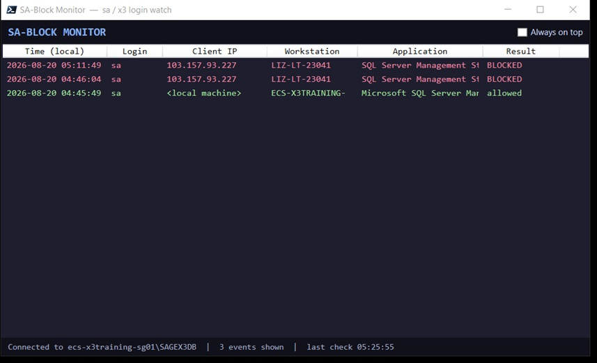
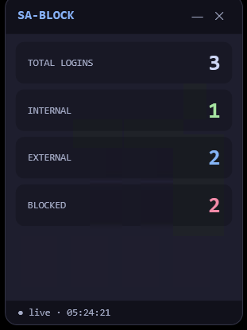

# SA-Block

Restricts SQL Server logins such as **`sa`** so they can only connect from
localhost or a hard-coded allowlist of IP addresses and hostnames,
logs every attempt, and provides two real-time desktop monitors — a full event feed
and a compact corner widget.

## Screenshots

### Full Monitor



### Corner Widget



## Features

- Restrict selected SQL Server logins such as `sa` and `Administrator`.
- Allow connections only from localhost or configured trusted IP addresses.
- Optionally allow trusted workstation names.
- Audit allowed and blocked login attempts.
- Monitor login activity in real time.
- Full desktop monitor with detailed connection information.
- Compact always-on-top widget with login statistics.
- Emergency recovery through the SQL Server Dedicated Admin Connection (DAC).

## Files

| File | What it does |
|---|---|
| `1_create_audit_table.sql` | Creates the `SABlockAudit` database and `dbo.LoginAudit` table. Run first. |
| `2_create_logon_trigger.sql` | Installs the server logon trigger `TR_SA_Block_RestrictedLogins`. Run second, **after editing the allowlists**. |
| `3_diagnose.sql` | Troubleshooting queries — checks whether the trigger is installed/enabled, shows the IP SQL Server sees for you, lists the last 30 audited attempts, and displays the live trigger definition. |
| `SA-Block-Monitor.ps1` | Full desktop monitor — live row-by-row feed of allowed/blocked attempts with time, login, IP, workstation, and application. |
| `SA-Block-Widget.ps1` | Compact corner widget — shows `TOTAL LOGINS`, `INTERNAL`, `EXTERNAL`, and `BLOCKED`. Beeps and flashes when the blocked count increases. |
| `SA-Block-Widget-Silent.vbs` | Double-click launcher that starts the widget with **no console window**. Keep it next to `SA-Block-Widget.ps1`. |

## Installation

### 1. Prepare a recovery login

Before installing the trigger, make sure you have at least one other sysadmin login
that is **not** `sa` or `Administrator`.

If the trigger ever misbehaves, that login — or the DAC described in
[Emergency Recovery](#locked-out-emergency-recovery) — is how you get back in.

### 2. Configure the trigger

Open `2_create_logon_trigger.sql` and edit these sections:

- **Restricted logins** — currently `N'sa', N'Administrator'`.
- **IP allowlist** — replace the example IPs with your real trusted IPs.
- **Trusted workstation names** — optionally add real machine names, or **delete this
  block**. Deleting it is recommended on internet-facing servers.

### 3. Create the audit database

In SSMS, connected as a sysadmin, run:

```text
1_create_audit_table.sql
```

### 4. Install the logon trigger

Run:

```text
2_create_logon_trigger.sql
```

### 5. Test immediately

Test an `sa` connection from:

1. An allowed machine.
2. A non-allowed machine.

Do this before walking away from the server. If something looks wrong, run
`3_diagnose.sql`.

## IP Addresses vs. Hostnames

SQL Server's logon event reports the client only as an **IP address** (or the literal
text `<local machine>` for shared-memory/local connections) — never a DNS/domain name.

Therefore, the **IP allowlist is the real security boundary**.

The optional hostname block matches `HOST_NAME()`, which is **self-reported by the
client and trivially spoofable**. Anyone can put `Workstation ID=YOUR-PC-NAME` in a
connection string and impersonate a trusted machine.

This was proven during testing: a remote login was allowed purely because the laptop's
name was in the list.

Treat hostnames as a convenience for trusted DHCP machines on a private network,
**never as protection on a server exposed to the internet**.

## Important: The Trigger Only Affects New Logins

Connections that were already open when the trigger was created stay alive.

To test the trigger, disconnect and reconnect, or open a fresh SSMS connection.

## Desktop Monitors

Both monitor scripts have a CONFIG block at the top. Edit it before running,
especially:

```powershell
$ServerInstance
```

Examples:

```text
"MYERVER\ECS"
"159.138.88.70,1433"
```

The default `localhost` will **not** find a named instance. This is the most common
cause of the widget showing `offline`.

### Corner Widget

For everyday monitoring, double-click:

```text
SA-Block-Widget-Silent.vbs
```

The widget:

- Runs without a console window.
- Parks itself in the bottom-right corner.
- Stays always on top.
- Can be dragged to another position.
- Shows the actual SQL error when you hover over the status bar if it is `offline`.

### Full Monitor

Run:

```powershell
powershell -ExecutionPolicy Bypass -File .\SA-Block-Monitor.ps1
```

### PowerShell Encoding

Both scripts are saved as UTF-8 **with BOM**. This is required so Windows PowerShell
5.1, which the VBS launcher uses, reads the symbols correctly.

If you re-save the scripts in an editor, keep the encoding as **UTF-8 with BOM**.

## Authentication

Windows authentication is used by default.

If your Windows account only has SQL access through the local Administrators group,
a non-elevated launch may fail to connect.

You can either:

- Grant the account a direct SQL login; or
- Set `$UseWindowsAuth = $false` and use a read-only SQL login.

Example:

```sql
USE [SABlockAudit];

CREATE USER [monitor_reader] FOR LOGIN [monitor_reader];  -- create the login first

GRANT SELECT ON dbo.LoginAudit TO [monitor_reader];
```

## Troubleshooting

| Symptom | Cause / Fix |
|---|---|
| Trigger doesn't block anyone | Run `3_diagnose.sql`. Usually: script 2 never ran on this server, your IP/hostname is in the live allowlist, or you're reusing a connection opened before the trigger existed. |
| Widget/monitor shows offline | Check `$ServerInstance` first. Named instances need the full instance name. Also check connectivity/authentication and hover over the widget's status bar for the actual error. |
| Garbled characters (`â€"`)| The script lost its UTF-8 BOM. Re-save it as UTF-8 with BOM. |
| Legitimate login is blocked | Add its IP to the allowlist and re-run script 2. `CREATE OR ALTER` replaces the trigger in place. |

## Uninstall / Rollback

To remove the logon trigger:

```sql
DROP TRIGGER [TR_SA_Block_RestrictedLogins] ON ALL SERVER;
```

Optionally remove the audit database:

```sql
DROP DATABASE [SABlockAudit];
```

## Locked Out? Emergency Recovery

Logon triggers do **not** fire on the Dedicated Admin Connection (DAC).

Connect using the DAC:

```text
sqlcmd -S YOURSERVER -A -U your_admin_login -P ...
```

Then remove the trigger:

```sql
DROP TRIGGER [TR_SA_Block_RestrictedLogins] ON ALL SERVER;
```

For a remote connection, DAC must be enabled:

```sql
sp_configure 'remote admin connections', 1;
RECONFIGURE;
```

Otherwise, run `sqlcmd` directly on the SQL Server itself.

## Notes

- Audit inserts are wrapped in TRY/CATCH, so a logging failure can never lock out 
  unless added in to the `TR_SA_Block_RestrictedLogins` TRIGGER .
-`EventTimeUtc` is stored in UTC; both monitors convert it to local time.
- Blocked clients see: *"Logon failed for login 'sa' due to trigger execution"*.
  This is the expected SQL Server message for a rolled-back logon trigger.
  
- **Internet-facing servers:** Keep in mind, a logon trigger runs after password validation, so it
  does not stop brute-force attempts. It's firewall... 
